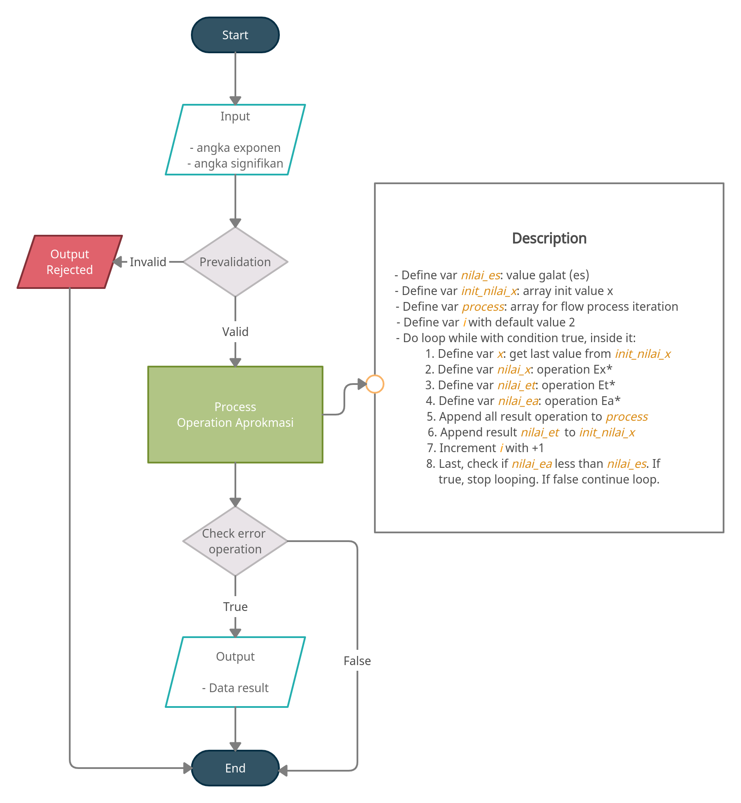

## Metode Numerik Apps 

### Feature
- Calculate the value from real

### Work Flow 


### Requirement
- Python ^3.9
- Flask ^2.1

### Installation 
- clone project
- create virtual env with following command (ubuntu or popos)
  ```
  python3 -m venv venv
  ```
- activate the virtual env with :
  ```
  . venv/bin/activate
  ```  
- pip install -U pip & pip install -r requirements.txt
- copy ``config/config.py.example`` to ``config/config.py``

### Running
```
flask run
```
