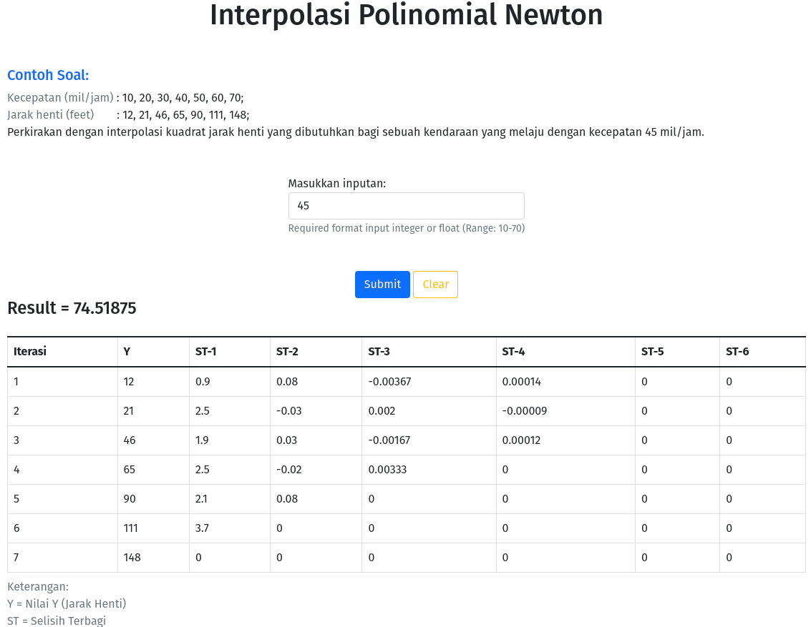

## PROGRAM METODE NUMERIK 

### Feature
- [**Aproksimasi Error dan Literasi**](https://agprstyutdi.pythonanywhere.com/introduction-aproksimasi)


- [**Interpolasi Polinomial Newton**](https://agprstyutdi.pythonanywhere.com/introduction-polinom-newton)


### Requirement
- Python ^3.9

### Installation 
- clone project
- create virtual env with following command (ubuntu or popos)
  ```
  python3 -m venv venv
  ```
- activate the virtual env with :
  ```
  . venv/bin/activate
  ```
- pip install -U pip & pip install -r requirements.txt
- copy ``config/config.py.example`` to ``config/config.py``

### Running
```
./run.sh
```

## ``Welcome for contribute!``
